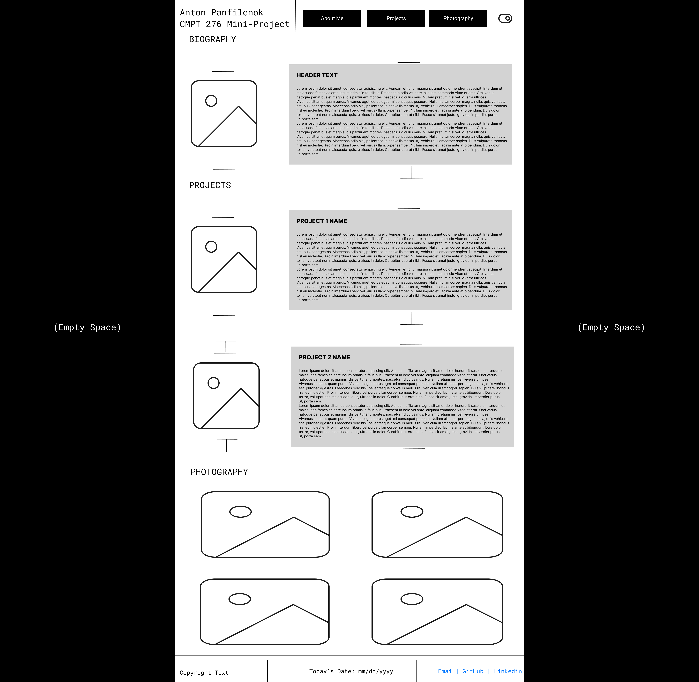
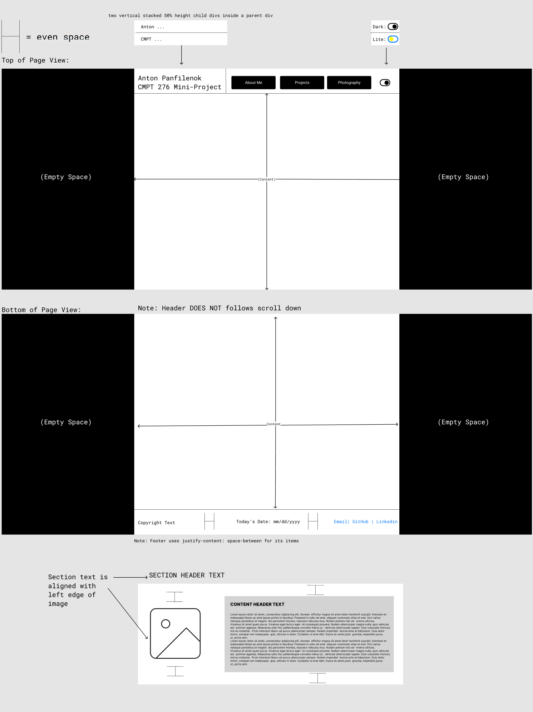

# Website Link
https://anton-pan.github.io/CMPT-276-Mini-Project/ \
*(**NOT** https://anton-pan.github.io - this is an earlier portfolio website from before this class)*

# License
This project is . I chose this license because this project contains photos taken *by* me, and photos taken *of* me, which I would want linked back to myself as the source. Other than being properly credited, I don't care what people do with my project.

# Wireframe
## Description
The site follows the standard one-page, 50%-width-and-centered approach that most portfolio websites use.
\
There is a header/navbar at the top of the page, which contains buttons that scroll down to the relevant content tabs, in addition to a dark mode/light mode toggle switch, styled in such a way that it represents its current state (moon/stars for dark mode, sun/sky for light mode).
\
The biography and project tabs use the same base, with an image to the left, and header text + body text on the right. Everything is centered vertically to prevent the content from looking cramped.
\
The photography section uses a simple 2x2 grid, with padding between each image to once again prevent the content from looking cramped.
There is no text or writeups for the photography section, since the images are the most important part.
\
The footer is a 3-column grid, containing a copyright notice, which is pushed all the way to the left edge of its box, a 'today's date' feature (just for fun), which is centered in its box and thus centered in the entire footer, and a box containing links to my github page, linkedin and email, which is pushed all the way to the right.
The links box itself is a 3-column grid, and is styled in such a way that the different-length strings will be evenly centered ans spaced out amongst one another.

## Full Site Wireframe


## Wireframe Components and In-Depth Explanations


# AI Declaration Form


# Credits
Thank you to https://uiverse.io/RiccardoRapelli/jolly-chicken-91 (MIT License) for providing the CSS code for the visual styling of the light/dark mode toggle switch, which is used/referenced in `` and `` \
Thank you to https://digitallytailored.github.io/Classless.css/ (MIT License) for providing the styling/UI library and the functionality for the light/dark mode toggle switch, which are used/referenced in `` and ``

# Develpment Notes:
gh-pages is installed **locally**, and therefore cannot be called directly in the CLI.\
Instead, use ```npx gh-pages ${COMMAND}```\

The ```predeploy``` script *should* run before the ```deploy``` script. But always check after running it.\

Vite needs a ```base``` set in ```vite-config.js```. \
Since this is a project page  deploying to ```https://Anton-Pan.github.io/CMPT-276-Mini-Project/```) ```base``` should be set to ```/CMPT-276-Mini-Project/```.\


